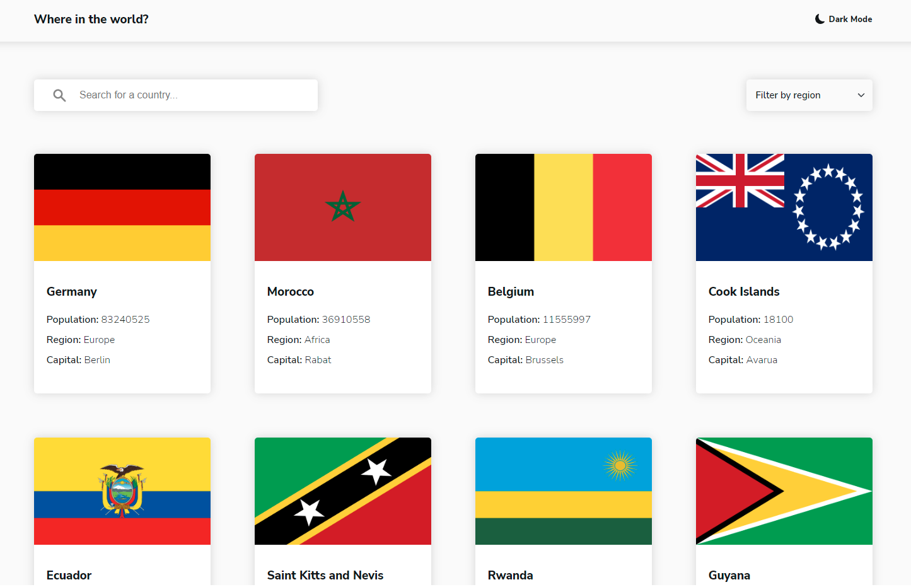

# Frontend Mentor - REST Countries API with color theme switcher solution

This is a solution to the [REST Countries API with color theme switcher challenge on Frontend Mentor](https://www.frontendmentor.io/challenges/rest-countries-api-with-color-theme-switcher-5cacc469fec04111f7b848ca). Frontend Mentor challenges help you improve your coding skills by building realistic projects. 

### Screenshot

### Links

- Solution URL: [Github](https://github.com/MousaAzm/rest-countries-api)
- Live Site URL: [Live Design](https://country-api-rest.netlify.app/)

### Built with

- React

## Author

- Frontend Mentor - [@MousaAzimi](https://www.frontendmentor.io/profile/MousaAzm)